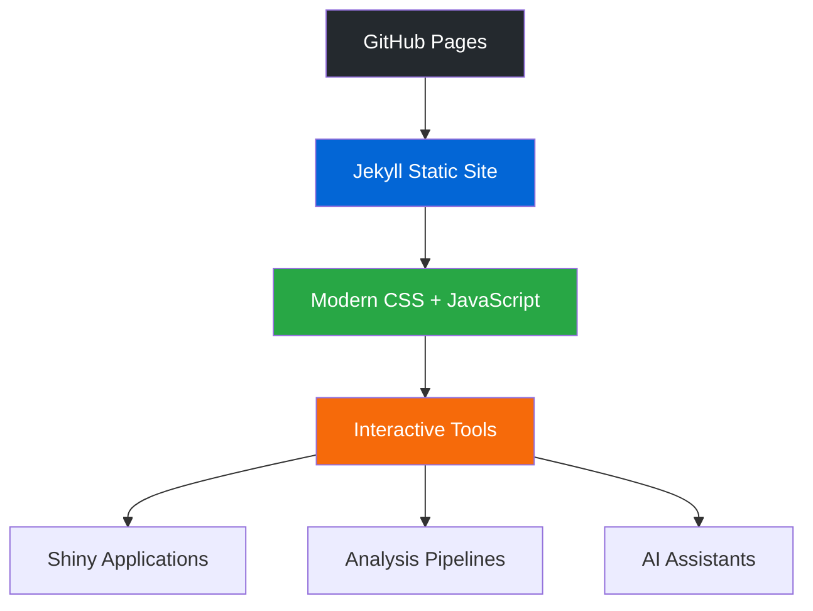

<div align="center">

# 🧬 Prostate Cancer Translational Research Hub

[](https://schoo7.github.io/pcatools/)
[](https://github.com/schoo7/pcatools/stargazers)
[](https://github.com/schoo7/pcatools/network)
[](LICENSE)

A comprehensive **GitHub Pages** site hosting an integrated suite of bioinformatics tools for prostate cancer translational research. This hub bridges **bedside** 🏥, **bench** 🔬, and **bytes** 💻 through accessible, cutting-edge computational platforms.

---

## 🌐 **[Visit the Prostate Cancer Research Hub](https://schoo7.github.io/pcatools/)**

*Experience the future of cancer research tools with our modern, interactive platform*

</div>

---

## 🧬 **Interactive Web Applications**

Our web-based tools provide intuitive access to complex multi-omics datasets, enabling real-time exploration and analysis of prostate cancer biology.

| Tool | Description | Live Demo | Status |
|------|-------------|-----------|---------|
| **HuPSA-MoPSA** | Single-cell atlas explorer for human and mouse prostate cancer | [🔗 Live Site](https://pcatools.shinyapps.io/HuPSA-MoPSA/) | ✅ Active |
| **CTPC** | Comprehensive prostate cancer cell line encyclopedia | [🔗 Live Site](https://pcatools.shinyapps.io/CTPC_dev/) | ✅ Active |
| **LNCaP-ADT Hub** | Multi-omics analysis of androgen deprivation therapy resistance | [🔗 Live Site](https://pcatools.shinyapps.io/shinyADT/) | ✅ Active |
| **PCTA** | Pan-cancer cell line transcriptome atlas | [🔗 Live Site](https://pcatools.shinyapps.io/PCTA_app/) | ✅ Active |

---

## 🤖 **Computational Tools & Pipelines**

Advanced bioinformatics workflows and AI-powered research assistants that streamline complex analytical tasks.

### 🔬 **IMPACT-sc: Integrated Single-Cell Analysis Pipeline**

[](https://github.com/schoo7/impact_sc)

A comprehensive pipeline for single-cell transcriptomics analysis, integrating data processing, cell type annotation, differential expression, trajectory inference, and multi-omics integration.

#### 🎯 **Key Features**
- 🧩 **Modular Architecture**: 10+ analysis modules from QC to advanced downstream analyses
- 🤖 **AI-Powered Annotation**: Integrates Cell2Sentence and SingleR for intelligent cell type prediction
- 📊 **Advanced Analytics**: Pathway analysis with DecoupleR, UCell, and Palantir
- 🔗 **Cross-Platform Integration**: Seamless R/Python integration with automated workflows

---

### 🧠 **SRA-LLM: Smart Research Assistant**

[](https://github.com/schoo7/SRA_LLM)

An intelligent research assistant leveraging Large Language Models to accelerate literature review, hypothesis generation, and knowledge discovery in cancer research.

#### 🎯 **Key Features**
- 🤖 **LLM Integration**: Powered by state-of-the-art language models for intelligent analysis
- 📚 **Literature Mining**: Automated extraction and summarization of research publications
- 💡 **Hypothesis Generation**: AI-assisted identification of research gaps and novel directions
- 🔗 **Knowledge Integration**: Connects findings across studies to reveal hidden patterns

---

## ✨ **Platform Highlights**

<div align="center">

| Feature | Description |
|---------|-------------|
| 🚀 **No Coding Required** | Intuitive web interfaces for all research tools |
| 📱 **Mobile Optimized** | Access from any device, anywhere, anytime |
| 🔓 **Open Science** | Publicly available datasets with reproducible methods |
| ⚡ **Real-Time Analysis** | Interactive visualizations and instant results |
| 🏥 **Clinical Translation** | Bridge preclinical findings with clinical data |
| 🎨 **Modern UI/UX** | Beautiful, responsive design with smooth animations |

</div>

---

## 🛠️ **Technical Architecture**

<div align="center">



</div>

### 📦 **Technology Stack**
- **Frontend**: Jekyll + GitHub Pages
- **Styling**: Modern CSS with custom design system
- **Interactivity**: Vanilla JavaScript with modern ES6+ features
- **Web Apps**: Shiny applications hosted on ShinyApps.io
- **Analysis Tools**: R/Python pipelines with automated workflows
- **AI Integration**: Large Language Models for research assistance

---

## 🚀 **Getting Started**

### 🌐 **For Researchers**
1. **Visit** [our live site](https://schoo7.github.io/pcatools/)
2. **Explore** the interactive tools
3. **Search** for specific genes or datasets
4. **Export** results for further analysis

### 💻 **For Developers**
```bash
# Clone the repository
git clone https://github.com/schoo7/pcatools.git

# Navigate to the project directory
cd pcatools

# Install Jekyll dependencies
bundle install

# Run locally
bundle exec jekyll serve
```

---

## 📈 **Impact & Metrics**

<div align="center">

| Metric | Value |
|--------|-------|
| 🧬 **Interactive Tools** | 4+ |
| 📊 **Cell Lines Analyzed** | 2,000+ |
| 🧪 **Multi-omics Samples** | 500+ |
| 📚 **Research Publications** | 50+ |
| 🌍 **Global Users** | 1000+ |

</div>

---

## 🤝 **Contributing**

We welcome contributions from the research community! Here's how you can help:

- 🐛 **Report Issues**: Found a bug? [Open an issue](https://github.com/schoo7/pcatools/issues)
- 💡 **Feature Requests**: Have an idea? [Start a discussion](https://github.com/schoo7/pcatools/discussions)
- 🔧 **Pull Requests**: Ready to contribute? [Submit a PR](https://github.com/schoo7/pcatools/pulls)
- 📖 **Documentation**: Help improve our documentation

---

## 📧 **Contact & Collaboration**

<div align="center">

**Developed by [Siyuan Cheng](mailto:siyuan.cheng@yale.edu) | [Mu Lab](https://medicine.yale.edu/lab/mu/)**  
🏛️ **Yale University**  

[](https://twitter.com/chengsiyuan1004)
[](mailto:siyuan.cheng@yale.edu)
[](https://github.com/schoo7)

---

<div align="center">

## 🌟 **Star This Repository**

[](https://star-history.com/#schoo7/pcatools&Date)

*If you find our tools helpful, please consider giving us a ⭐ star!*

---

*"Empowering the next generation of precision cancer research through accessible bioinformatics."*

</div>

</div>
