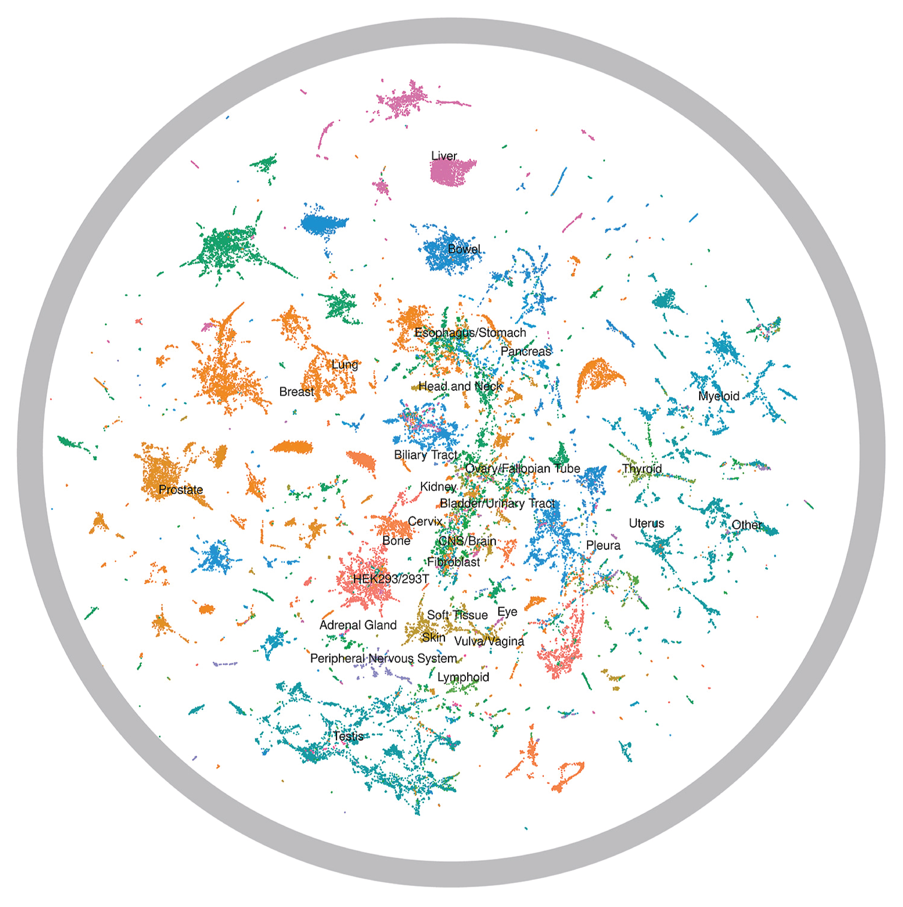

  

    

      <h1>Prostate Cancer Translational Research Hub</h1>
      

        Empowering clinicians and researchers with cutting-edge bioinformatics tools that bridge the gap between 
        <strong>bedside</strong>, <strong>bench</strong>, and <strong>bytes</strong>. Our comprehensive suite of 
        open-access platforms accelerates discovery, enables precision medicine, and democratizes access to 
        advanced cancer research capabilities—no coding required.
      

      

        

          4
          Interactive Tools
        

        

          2,000+
          Cell Lines
        

        

          500+
          Multi-omics Samples
        

      

    

  

## Interactive Web Applications

Our web-based tools provide intuitive access to complex multi-omics datasets, enabling real-time exploration and analysis of prostate cancer biology.

---

  

    

      

      <h3 class="tool-title">HuPSA-MoPSA: Single-Cell Atlas Explorer</h3>
    

    
    <a href="https://pcatools.shinyapps.io/HuPSA-MoPSA/" class="tool-url" target="_blank">
      https://pcatools.shinyapps.io/HuPSA-MoPSA/
    </a>
    
    

      <strong>Decode Human & Mouse Prostate Cancer at Single-Cell Resolution</strong> 
      Navigate the cellular landscape of prostate cancer with unprecedented detail through our comprehensive single-cell RNA sequencing atlas.
    

    
    

      

        

        
<strong>Discover Novel Biomarkers:</strong> Uncover hidden cellular populations like KRT7-high and SOX2/FOXA2+ progenitor-like cells linked to aggressive disease progression

      

      

        

        
<strong>Clinical Translation:</strong> Validate subtype markers across 50+ bulk transcriptome datasets from human clinical specimens

      

      

        

        
<strong>Interactive Visualization:</strong> Generate publication-ready figures with real-time gene expression analysis

      

      

        

        
<strong>Cross-Species Analysis:</strong> Compare molecular profiles between human and mouse models for translational insights

      

    

    
    
  

---

  

    

      

      <h3 class="tool-title">CTPC: Prostate Cancer Cell Line Encyclopedia</h3>
    

    
    <a href="https://pcatools.shinyapps.io/CTPC_dev/" class="tool-url" target="_blank">
      https://pcatools.shinyapps.io/CTPC_dev/
    </a>
    
    

      <strong>Precision Medicine Starts with Precise Preclinical Models</strong> 
      Optimize your research model selection with comprehensive molecular profiling of 2,000+ prostate cancer cell lines.
    

    
    

      

        

        
<strong>Golden-Standard Baselines:</strong> Access molecular profiles of established cell lines (LNCaP, PC3, DU145) with quality-controlled data

      

      

        

        
<strong>Treatment-Gene Networks:</strong> Identify drug-responsive pathways for mechanistic studies or drug repurposing

      

      

        

        
<strong>Biomarker Validation:</strong> Cross-reference datasets to prioritize targets with clinical translational potential

      

      

        

        
<strong>Data Export:</strong> Download normalized expression matrices and analysis results for downstream applications

      

    

    
    
  

---

  

    

      

      <h3 class="tool-title">LNCaP-ADT Multi-Omics Hub</h3>
    

    
    <a href="https://pcatools.shinyapps.io/shinyADT/" class="tool-url" target="_blank">
      https://pcatools.shinyapps.io/shinyADT/
    </a>
    
    

      <strong>Deciphering Androgen Deprivation Resistance Mechanisms</strong> 
      Explore the molecular evolution of treatment resistance through integrated multi-omics analysis of 500+ LNCaP samples during androgen deprivation therapy.
    

    
    

      

        

        
<strong>Multi-Omics Integration:</strong> Correlate transcriptomic, epigenetic, and transcription factor occupancy data

      

      

        

        
<strong>Dynamic Adaptation Maps:</strong> Track molecular changes during ADT at single-cell resolution

      

      

        

        
<strong>Resistance Mechanisms:</strong> Identify drivers of castration resistance and therapeutic vulnerabilities

      

      

        

        
<strong>Network Analysis:</strong> Export co-expression networks for experimental validation

      

    

    
    
  

---

  

    

      

      <h3 class="tool-title">PCTA: Pan-Cancer Cell Line Transcriptome Atlas</h3>
    

    
    <a href="https://pcatools.shinyapps.io/PCTA_app/" class="tool-url" target="_blank">
      https://pcatools.shinyapps.io/PCTA_app/
    </a>
    
    

      <strong>Expanding Horizons Beyond Prostate Cancer</strong> 
      Compare prostate cancer biology with 535+ cell lines across 114 cancer types to identify conserved mechanisms and unique therapeutic opportunities.
    

    
    

      

        

        
<strong>Cross-Cancer Insights:</strong> Comprehensive dataset spanning 24,965 genes across 84,385 samples from 5,677 studies

      

      

        

        
<strong>Biomarker Discovery:</strong> Validate prostate cancer-specific markers and identify cross-cancer therapeutic targets

      

      

        

        
<strong>Tissue-Specific Clustering:</strong> Visualize relationships between cancer types and identify shared pathways

      

      

        

        
<strong>Drug Repurposing:</strong> Leverage pan-cancer data to identify therapeutic opportunities from other oncology areas

      

    

    
    
  

---

## Computational Pipelines & Analysis Tools

Advanced bioinformatics workflows and AI-powered research assistants that streamline complex analytical tasks.

---

  

    

      

      <h3 class="tool-title">IMPACT-sc: Integrated Single-Cell Analysis Pipeline</h3>
    

    
    <a href="https://github.com/schoo7/impact_sc" class="tool-url" target="_blank">
      https://github.com/schoo7/impact_sc
    </a>
    
    

      <strong>Modular Single-Cell RNA-seq Analysis Workflow</strong> 
      A comprehensive pipeline for single-cell transcriptomics analysis, integrating data processing, cell type annotation, differential expression, trajectory inference, and multi-omics integration.
    

    
    

      

        

        
<strong>Modular Architecture:</strong> 10+ analysis modules from QC to advanced downstream analyses with interactive configuration

      

      

        

        
<strong>AI-Powered Annotation:</strong> Integrates Cell2Sentence for semantic cell type prediction and SingleR for reference-based annotation

      

      

        

        
<strong>Advanced Analytics:</strong> Pathway analysis with DecoupleR, gene signature scoring with UCell, and pseudotime analysis with Palantir

      

      

        

        
<strong>Cross-Platform Integration:</strong> Seamless R/Python integration with automated environment management and dependency handling

      

    

    
    <h4>Key Analysis Modules:</h4>
    

      

        

        
<strong>Data Processing:</strong> QC filtering, normalization, and batch correction with Harmony

      

      

        

        
<strong>Cell Type Annotation:</strong> Multi-method annotation combining Seurat clustering, SingleR, and Cell2Sentence

      

      

        

        
<strong>Differential Expression:</strong> Statistical analysis with Gene Set Enrichment Analysis (GSEA)

      

      

        

        
<strong>Pathway Analysis:</strong> Transcription factor activity inference and pathway scoring

      

    

    
     Python
     R
     Single-Cell
     AI/ML
  

---

  

    

      

      <h3 class="tool-title">SRA-LLM: Smart Research Assistant</h3>
    

    
    <a href="https://github.com/schoo7/SRA_LLM" class="tool-url" target="_blank">
      https://github.com/schoo7/SRA_LLM
    </a>
    
    

      <strong>AI-Powered Research Literature Analysis</strong> 
      An intelligent research assistant leveraging Large Language Models to accelerate literature review, hypothesis generation, and knowledge discovery in cancer research.
    

    
    

      

        

        
<strong>LLM Integration:</strong> Powered by state-of-the-art language models for intelligent literature analysis and synthesis

      

      

        

        
<strong>Literature Mining:</strong> Automated extraction and summarization of key findings from research publications

      

      

        

        
<strong>Hypothesis Generation:</strong> AI-assisted identification of research gaps and novel research directions

      

      

        

        
<strong>Knowledge Integration:</strong> Connects findings across studies to reveal hidden patterns and relationships

      

    

    
    <h4>Research Applications:</h4>
    

      

        

        
<strong>Literature Review:</strong> Automated summarization and synthesis of research papers

      

      

        

        
<strong>Concept Discovery:</strong> Identify emerging trends and novel therapeutic targets

      

      

        

        
<strong>Experimental Design:</strong> AI-assisted methodology recommendations and protocol optimization

      

      

        

        
<strong>Data Interpretation:</strong> Contextual analysis of experimental results within existing literature

      

    

    
     LLM
     NLP
     Research
     AI Assistant
  

---

## Getting Started

  

    

    
<strong>Choose Your Tool:</strong> Select the platform that best fits your research question or analytical needs

  

  

    

    
<strong>Explore Data:</strong> Use intuitive interfaces to search genes, browse datasets, or configure analysis pipelines

  

  

    

    
<strong>Generate Insights:</strong> Create publication-ready visualizations and export results for further analysis

  

  

    

    
<strong>Validate Findings:</strong> Cross-reference results across multiple tools and datasets for robust conclusions

  

---

## Why Choose Our Platform?

  

    

    
<strong>No Coding Required:</strong> Intuitive web interfaces make advanced bioinformatics accessible to all researchers

  

  

    

    
<strong>Mobile Optimized:</strong> Analyze data anywhere, anytime—even on your smartphone or tablet

  

  

    

    
<strong>Open Science:</strong> All datasets are publicly available with peer-reviewed, reproducible methods

  

  

    

    
<strong>Real-Time Analysis:</strong> Instant results with interactive visualizations and customizable parameters

  

  

    

    
<strong>Clinical Translation:</strong> Bridge preclinical findings with clinical data for translational insights

  

  

    

    
<strong>Comprehensive Coverage:</strong> From single cells to populations, from discovery to validation

  

  

    

      <strong>Developed by <a href="mailto:siyuan.cheng@yale.edu">Siyuan Cheng</a> | Mu Lab</strong> 
      Bridging Prostate Cancer Biology & Computational Innovation 
      <a href="https://twitter.com/chengsiyuan1004" target="_blank">@chengsiyuan1004</a> | 
      <a href="mailto:siyuan.cheng@yale.edu">siyuan.cheng@yale.edu</a>
    

  

