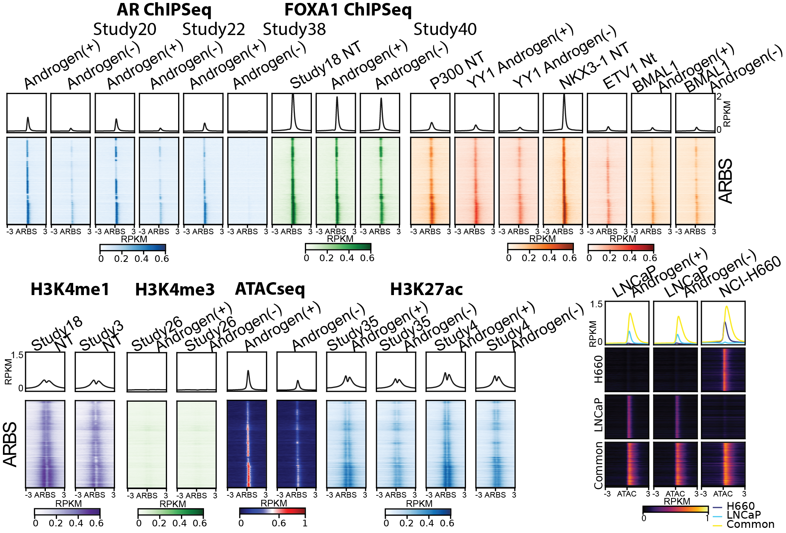

# **BBB: Bedside to Bench to Bytes**  
**Empowering Prostate Cancer Research with Accessible Bioinformatics Tools**  

Our suite of **open-access platforms** bridges clinical data, preclinical models, and multi-omics insights—no coding required. Designed for **clinicians** and **researchers**, these tools decode prostate cancer heterogeneity, streamline biomarker discovery, and accelerate therapeutic development. Accessible anytime, anywhere—even on your smartphone.  

---

## **HuPSA-MoPSA: Single-Cell Atlas Explorer**  
**Explore Human & Mouse Prostate Cancer at Single-Cell Resolution**  
*URL*: [https://pcatools.shinyapps.io/HuPSA-MoPSA/](https://pcatools.shinyapps.io/HuPSA-MoPSA/)  
{: style="width: 100%; max-width: 800px; border: 1px solid #ddd; margin: 20px 0;"}  

### **Why It Matters for Your Work**  
- **Discover Novel Subtypes**: Uncover hidden populations like *KRT7-high* and *SOX2/FOXA2+ progenitor-like cells* linked to aggressive disease.  
- **Clinical Translation**: Validate subtypes in bulk transcriptome data from human specimens to guide patient stratification.  
- **Interactive Visualization**: Instantly plot gene expression across 50+ single-cell/bulk RNA-seq datasets from clinical cohorts and mouse models.  

**Key Features**  
✅ Browser-friendly, zero-installation  
✅ Export publication-ready figures  
✅ Compare human/mouse molecular profiles  

---

## **CTPC: Prostate Cancer Cell Line Encyclopedia**  
**Precision Medicine Starts with Precise Preclinical Models**  
*URL*: [https://pcatools.shinyapps.io/CTPC_dev/](https://pcatools.shinyapps.io/CTPC_dev/)  
{: style="width: 100%; max-width: 800px; border: 1px solid #ddd; margin: 20px 0;"}  

### **Optimize Your Lab’s Model Selection**  
- **Golden-Standard Baselines**: Molecular profiles of 2,000+ prostate cancer cell lines (e.g., LNCaP, PC3, DU145).  
- **Treatment-Gene Networks**: Identify drug-responsive pathways for mechanistic studies or drug repurposing.  
- **Biomarker Validation**: Cross-reference clinical datasets to prioritize targets with translational potential.  

**For Researchers**  
🔬 Compare cell line responses to therapies  
🔬 Predict gene knockout/drug effects  
🔬 Download normalized expression matrices  

---

## **LNCaP-ADT Multi-Omics Hub**  
**Deciphering Androgen Deprivation Resistance Mechanisms**  
*URL*: [https://pcatools.shinyapps.io/shinyADT/](https://pcatools.shinyapps.io/shinyADT/)  
{: style="width: 100%; max-width: 800px; border: 1px solid #ddd; margin: 20px 0;"}  

### **Key to Overcoming Treatment Resistance**  
- **Multi-Omics Integration**: Explore transcriptomic, epigenetic, and transcription factor occupancy data from 500+ LNCaP samples.  
- **Dynamic Adaptation Maps**: Track molecular shifts during androgen deprivation therapy (ADT) at single-cell resolution.  
- **Clinical Relevance**: Identify drivers of castration resistance and combinatorial therapeutic vulnerabilities.  

**Unlock Insights**  
🧬 Correlate chromatin accessibility with gene expression  
🧬 Filter datasets by treatment duration/dose  
🧬 Export co-expression networks for wet-lab validation  

---

## **How to Use These Tools**  
1. **Click any platform above** → Start exploring without registration.  
2. **Search genes** (e.g., *AR*, *KRT7*) or browse precomputed analyses.  
3. **Export results** directly into grants, papers, or lab meetings.  

---

### **Technical Highlights**  
- **No Bioinformatics Skills Needed**: Intuitive dropdown menus and filters.  
- **Mobile-Optimized**: Analyze data on your phone or tablet.  
- **Open Science**: All datasets are publicly available; methods peer-reviewed.  

---

*Developed by [Your Name/Lab], Bridging Prostate Cancer Biology & Computational Innovation.*  